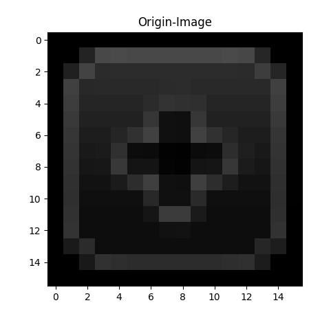
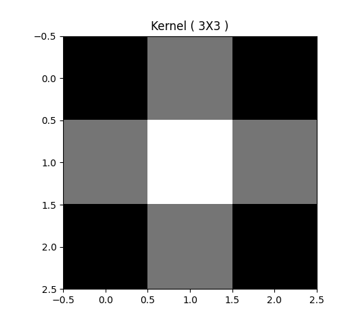
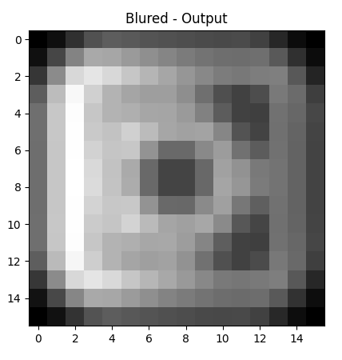
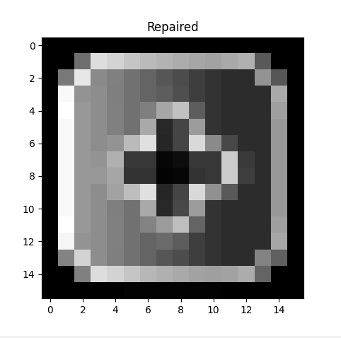

# Applied algebra 
### [field of study at university]

    
    

    
    

## Getting Started

Link on subject: [LINK](https://homel.vsb.cz/~vla04/vyuka/AA2017/index.php?main_file_param=ref)

In this project I've elaborated task from lessons. The objective of task is:
1. Take picture
2. Get Image-kernel 
3. Blur image
4. Repair image

### Prerequisites

1.Python interpreter

## Built With

* [Python](https://www.python.org/)

## Authors

* **Adrián Mindek** -  [Surzo18](https://github.com/surzo18)

## License

Free for non-commercial use only.

